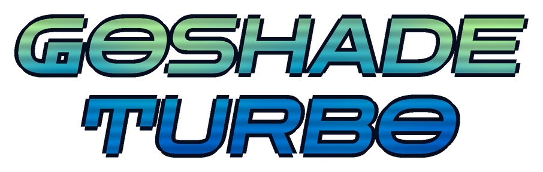

# GoShade Turbo




Godot editor plugin for building `canvas_item` shaders without writing shader
code. Stack typed layers from a bundled function library, tune them with
sliders, watch the live preview, export a self-contained `.gdshader`.

Design notes: `docs/DESIGN.md`.

## Install

1. Copy `addons/goshade_turbo` into your project's `addons/` directory.
2. Project Settings > Plugins, enable GoShade Turbo.

Requires Godot 4.4 or later. Tested on 4.4, 4.6 and 4.7.

## Usage

### Panel

The plugin adds a main screen tab next to 2D, 3D and Script. Three columns:
the stack list, the selected layer's properties, the live preview.

The add button opens a picker grouped by folder: generative, sdf, fieldops,
color, source, filter. Each entry shows its function name, kind signature
and description. The picker lists only entries whose output kind fits the
slot it was opened from.

Stack rules:

- A slot picks any layer below it. No forward references.
- A generator layer has a coord block: scale, offset, rotation, scroll
  speed, and two optional warp slots.
- The output block picks the output color layer and the alpha mode: a field
  layer, `texture` alpha, the color layer's own alpha, or `none`.
- Every stack edit goes through the editor's undo history. Slider edits go
  through the inspector, so they do too.

### Recipes

`Recipes` in the toolbar lists the `.tres` files under
`addons/goshade_turbo/recipes/` and opens one as a starting stack.

### Export

Export writes a self-contained `.gdshader`: a license notice, one
`// stack: <json>` line carrying the whole stack, then the shader body.
Opening that file in the panel rebuilds the stack from the header. No
`.tres` needed.

Export compares an existing file's body against a fresh codegen of its own
header and asks before overwriting a hand-edited body. Opening a file with
no `// stack:` header, an unparsable header, or an unknown schema version is
refused with the reason.

### `local` coordinate space

The coordinate space dropdown offers `uv`, `screen_uv` and `local`.
`local` is `VERTEX / gst_rect_size`, computed in `vertex()`, because
`VERTEX` inside `fragment()` is screen space in a `canvas_item` shader.

The plugin and the preview set the `gst_rect_size` uniform from the node's
rect size. An exported shader defaults it to `vec2(1.0)`. Set
`gst_rect_size` to the node's rect size on any node that gets a `local`
space shader, or it renders as if the node were 1x1.

## Tests

Build the script class cache once per clone, and again after adding any
`class_name` script:

```
godot --headless --path . --import
```

Codegen and unit tests, headless:

```
godot --headless --path . -s res://tests/run_codegen_tests.gd
```

Rendered checks. These need a GPU session: the `--headless` dummy driver
cannot read back viewport pixels.

```
godot --path . --rendering-driver opengl3 -s res://tests/run_render_checks.gd
```

Add `-- --write-screenshots` to save every checked stack's 128x128 render to
`sandbox/screenshots/<stack file stem>.png`.

Recipe motion checks at fixed times (1, 30 and 120 seconds):

```
godot --path . --rendering-driver opengl3 -s res://tests/run_recipe_motion_checks.gd
```

`godot` is whatever resolves to a Godot 4.4+ binary on your system.

## Library

57 functions, one row per manifest under `addons/goshade_turbo/library/`.
The kind signature reads `(input kinds) -> output kind`. `field` is a
scalar, `color` is a `vec4`. `(generator)` entries take a coord block
instead of input slots. `(source)` entries read `TEXTURE` or the screen
texture. `(filter)` entries take a `texture` or `screen` source layer and
sample it at neighbor offsets.

Regenerate this table after a library change:

```
godot --headless --path . -s res://tests/print_roster.gd
```

| id | function | kind signature | source_math |
|---|---|---|---|
| `color/add` | `color_add` | (color, color) -> color | additive blend, clamped sum, standard construction. |
| `color/brightness_contrast` | `brightness_contrast` | (color) -> color | linear brightness/contrast adjustment, standard image-processing construction. |
| `color/fill` | `fill` | () -> color | identity function, no external formula. |
| `color/gradient_map` | `gradient_map` | (field) -> color | linear color ramp via GLSL mix, standard gradient-map construction. |
| `color/hue_shift` | `hue_shift` | (color) -> color | hue rotation via an RGB-to-YIQ rotation matrix, standard technique (e.g. https://beesbuzz.biz/code/hsv_color_transforms.php). |
| `color/mix` | `color_mix` | (color, color, field) -> color | linear interpolation, standard GLSL builtin construction. |
| `color/multiply` | `color_multiply` | (color, color) -> color | multiply blend mode, W3C Compositing and Blending Level 1. |
| `color/overlay` | `blend_overlay` | (color, color) -> color | overlay blend mode, W3C Compositing and Blending Level 1. |
| `color/palette` | `palette` | (field) -> color | Inigo Quilez, "Palettes" (https://iquilezles.org/articles/palettes/), cosine-based palette generator. |
| `color/posterize` | `posterize` | (color) -> color | uniform color quantization into N levels, standard posterize construction. |
| `color/saturation` | `saturation` | (color) -> color | luminance-preserving saturation adjustment via linear interpolation to grayscale, standard technique (Poynton luma coefficients). |
| `color/screen` | `blend_screen` | (color, color) -> color | screen blend mode, W3C Compositing and Blending Level 1. |
| `color/soft_light` | `blend_soft_light` | (color, color) -> color | soft-light blend mode, W3C Compositing and Blending Level 1, section "Soft Light". |
| `fieldops/abs` | `gst_abs` | (field) -> field | absolute value, standard GLSL builtin construction. |
| `fieldops/add` | `add` | (field, field) -> field | scalar addition, no external source. |
| `fieldops/alpha` | `alpha` | (color) -> field | trivial vec4 alpha-channel read, no external source. |
| `fieldops/ease` | `ease` | (field) -> field | in: pow(x, x + 1). out: 1 - pow(1 - x, 2 - x). blended by bias. Own construction. At 0.5 blend it mirrors smoothstep. |
| `fieldops/fract` | `gst_fract` | (field) -> field | fractional part, standard GLSL builtin construction. |
| `fieldops/invert` | `invert` | (field) -> field | trivial unit-range complement, no external source. |
| `fieldops/max` | `gst_max` | (field, field) -> field | scalar maximum, standard GLSL builtin construction. |
| `fieldops/min` | `gst_min` | (field, field) -> field | scalar minimum, standard GLSL builtin construction. |
| `fieldops/mix` | `gst_mix` | (field, field, field) -> field | linear interpolation, standard GLSL builtin construction. |
| `fieldops/multiply` | `multiply` | (field, field) -> field | scalar multiplication, no external source. |
| `fieldops/pow` | `gst_pow` | (field) -> field | power function, standard GLSL builtin construction. Input clamped to non-negative because GLSL pow() is undefined for a negative base. |
| `fieldops/ratchet` | `ratchet` | (field) -> field | Own construction. mod(x + 1, x * x) descending sawtooth over a pow(1 - x, x + steep) ease-in floor, blended by x. The reset at 0.99 finishes the last tooth, which mod would only wrap at exactly 1. |
| `fieldops/remap` | `remap` | (field) -> field | standard linear range remap, no external source. |
| `fieldops/smoothstep` | `gst_smoothstep` | (field) -> field | Hermite smoothstep interpolation, standard GLSL builtin construction. Khronos GLSL ES 3.0 spec, section 8.3. |
| `filter/box_blur` | `box_blur` | (color) -> color (filter) | 3x3 box filter, unweighted mean, standard convolution kernel. |
| `filter/chromatic_split` | `chromatic_split` | (color) -> color (filter) | RGB channel split by opposing horizontal offsets, standard chromatic aberration construction. |
| `filter/dither` | `dither` | (color) -> color (filter) | ordered dithering via a per-pixel hash threshold before quantization, standard shader dither construction (hash after Sunday, GLSL hash function; matches Capsule Castle's own random()). |
| `filter/outline` | `outline` | (color) -> color (filter) | alpha edge detection via 4-neighbor max difference, standard sprite outline technique. |
| `filter/pixelate` | `pixelate` | (color) -> color (filter) | grid snapping / spatial quantization, standard pixelation construction. |
| `generative/cellular_edges` | `cellular_edges` | () -> field (generator) | F2 - F1 cellular edge construction over a jittered grid, per Inigo Quilez, "Voronoi Edges", https://iquilezles.org/articles/voronoilines/. The bright-boundary remap (1.0 - smoothstep(0.0, width, F2 - F1)) is our own addition on top of that construction. |
| `generative/checker` | `checker` | () -> field (generator) | standard floor-parity checkerboard construction, common technique, no single canonical source. |
| `generative/clock` | `clock` | () -> field | fract(TIME * speed), standard construction. Ignores position; feeds add or mix to animate a field value. Adding it before a fract is the same as adding unbounded time, since fract drops the whole part. |
| `generative/fbm` | `fbm` | () -> field (generator) | fractional Brownian motion: standard sum-of-octaves construction. See D. Ebert et al., "Texturing & Modeling: A Procedural Approach" (3rd ed., 2003), ch. 2. |
| `generative/hash` | `hash` | () -> field (generator) | sin/dot pseudo-random hash, a common GLSL technique. The Book of Shaders, ch. 10 "Random", https://thebookofshaders.com/10/ |
| `generative/linear_gradient` | `linear_gradient` | () -> field (generator) | standard axis-aligned linear ramp, common technique, no single canonical source. Angle is driven by the layer's coord rotation rather than a dedicated param. |
| `generative/perlin` | `perlin` | () -> field (generator) | classic 2D gradient (Perlin) noise: Ken Perlin, "An Image Synthesizer", SIGGRAPH 1985. Gradients here come from an angle derived through this library's own hash(), not a permutation table; that substitution is an implementation choice, not copied from any specific source. |
| `generative/radial_gradient` | `radial_gradient` | () -> field (generator) | standard normalized radial distance field, common technique, no single canonical source. |
| `generative/snoise` | `snoise` | () -> field (generator) | 2D simplex noise construction: Ken Perlin (2001). Skew/unskew derivation per Stefan Gustavson, "Simplex noise demystified" (2005). Gradients here come from an angle derived through this library's own hash() rather than a permutation table; that substitution is an implementation choice, not copied from any specific source. |
| `generative/stripes` | `stripes` | () -> field (generator) | standard periodic sine stripe construction, common technique, no single canonical source. Frequency and angle are driven by the layer's coord scale and rotation rather than a dedicated param. |
| `generative/value_noise` | `value_noise` | () -> field (generator) | value noise via bilinear interpolation over a hashed grid. The Book of Shaders, ch. 11 "Value Noise", https://thebookofshaders.com/11/ |
| `generative/voronoi` | `voronoi` | () -> field (generator) | cellular (Worley) noise via nearest feature-point distance over a jittered grid. The Book of Shaders, ch. 12 "Cellular Noise", https://thebookofshaders.com/12/ |
| `sdf/box` | `sdf_box` | () -> field (generator) | sdBox(p, b) = length(max(abs(p) - b, 0.0)) + min(max(d.x, d.y), 0.0). Inigo Quilez, "2D distance functions", https://iquilezles.org/articles/distfunctions2d/, entry "Box". b split into half_width/half_height (no vec2 param type in the manifest schema). |
| `sdf/circle` | `sdf_circle` | () -> field (generator) | sdCircle(p, r) = length(p) - r. Inigo Quilez, "2D distance functions", https://iquilezles.org/articles/distfunctions2d/, entry "Circle". |
| `sdf/intersect` | `sdf_intersect` | (field, field) -> field | opIntersection(d1, d2) = max(d1, d2). Inigo Quilez, "2D distance functions", https://iquilezles.org/articles/distfunctions2d/, section "Combinations". |
| `sdf/line` | `sdf_line` | () -> field (generator) | sdSegment(p, a, b): pa = p - a, ba = b - a, h = clamp(dot(pa, ba) / dot(ba, ba), 0.0, 1.0), length(pa - ba * h). Inigo Quilez, "2D distance functions", https://iquilezles.org/articles/distfunctions2d/, entry "Segment", with a = (-half_length, 0), b = (half_length, 0) and thickness subtracted (capsule combinator, same article). |
| `sdf/polygon` | `sdf_polygon` | () -> field (generator) | own construction: fold the angle around p into one sector of the regular polygon (mod against the sector angle), then compare the radial projection length(p) * cos(a) against the polygon's apothem (radius * cos(half sector angle)). In the spirit of the polar-coordinate constructions in Inigo Quilez's "2D distance functions", https://iquilezles.org/articles/distfunctions2d/, entry "Regular Polygon" (which this does not reproduce verbatim). |
| `sdf/ring` | `sdf_ring` | () -> field (generator) | annulus construction: abs(length(p) - radius) - thickness. Inigo Quilez, "2D distance functions", https://iquilezles.org/articles/distfunctions2d/, entry "Circle - unsigned/annulus" combinator. |
| `sdf/rounded_box` | `sdf_rounded_box` | () -> field (generator) | sdRoundBox(p, b, r): q = abs(p) - b + r; min(max(q.x, q.y), 0.0) + length(max(q, 0.0)) - r. Inigo Quilez, "2D distance functions", https://iquilezles.org/articles/distfunctions2d/, entry "Box - exact (rounded)". b split into half_width/half_height (no vec2 param type in the manifest schema). |
| `sdf/smooth_union` | `sdf_smooth_union` | (field, field) -> field | opSmoothUnion(d1, d2, k): h = clamp(0.5 + 0.5 * (d2 - d1) / k, 0.0, 1.0); mix(d2, d1, h) - k * h * (1.0 - h). Inigo Quilez, "2D distance functions", https://iquilezles.org/articles/distfunctions2d/, section "Combinations". |
| `sdf/star` | `sdf_star` | () -> field (generator) | own construction: fold the angle into one of 5 sectors, linearly interpolate the local radius between the outer radius and radius * inner_ratio across the sector, then subtract from length(p). In the spirit of the polar-coordinate constructions in Inigo Quilez's "2D distance functions", https://iquilezles.org/articles/distfunctions2d/, entry "Star 5" (which this does not reproduce verbatim). |
| `sdf/subtract` | `sdf_subtract` | (field, field) -> field | opSubtraction(d1, d2) = max(-d1, d2), applied here as subtract(a, b) = max(a, -b) so b is the shape removed from a. Inigo Quilez, "2D distance functions", https://iquilezles.org/articles/distfunctions2d/, section "Combinations". |
| `sdf/union` | `sdf_union` | (field, field) -> field | opUnion(d1, d2) = min(d1, d2). Inigo Quilez, "2D distance functions", https://iquilezles.org/articles/distfunctions2d/, section "Combinations". |
| `source/screen` | `gst_source_screen` | () -> color (source) | Godot 4 canvas_item shader built-in: hint_screen_texture sampler2D read at SCREEN_UV (Godot shading language reference, canvas_item built-ins). |
| `source/texture` | `gst_source_texture` | () -> color (source) | Godot 4 canvas_item shader built-in: TEXTURE sampler2D (Godot shading language reference, canvas_item built-ins). |

Every entry cites the source of its math. The code is written for this
library. `source_code_license` is set only where code itself was copied
from a permissive source (`generative/hash`, ported from the author's own
Capsule Castle shader).

## Credits

Logo: [Zen Dots](https://fonts.google.com/specimen/Zen+Dots), SIL Open Font
License 1.1, in `sandbox/logo/fonts/`. Rendered through the plugin's own
export, see `sandbox/logo/`.

## License

MIT. See `LICENSE`.
