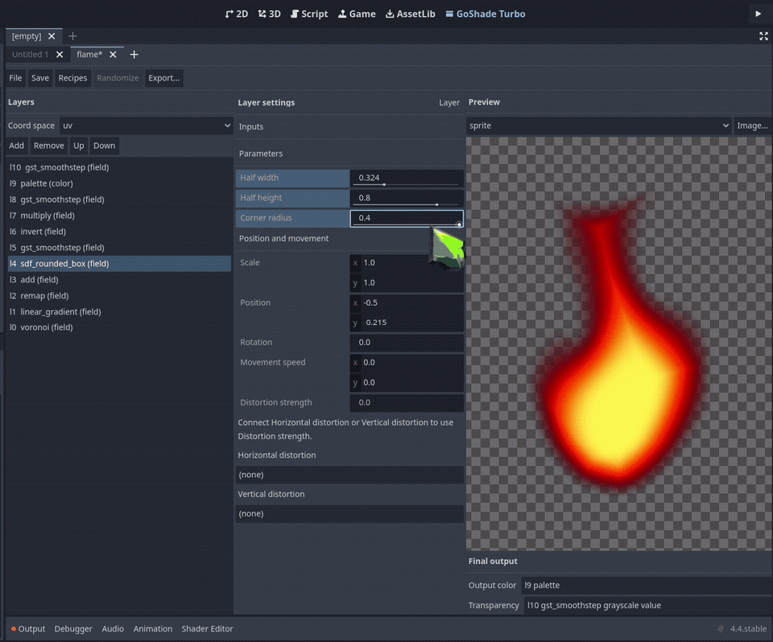

# GoShade Turbo

<p align="center">
  
</p>
<p align="center">
  
  
  
</p>

Godot editor plugin that composes `canvas_item` shaders from a typed layer library. Stack layers, tune them with sliders, preview live, export a `.gdshader`.

## What it does
- Adds a main screen tab: stack list, selected layer properties, live preview.
- Picks layers from 61 functions across generative, sdf, fieldops, color, source, filter.
- Exports a `.gdshader` with a `// stack: <json>` header; opening it rebuilds the stack.
- Loads `.tres` recipes from `addons/goshade_turbo/recipes/` as a starting stack.
- Routes every stack and slider edit through editor undo.

## Requirements
- Godot `>= 4.4`. Tested on `4.4`, `4.6`, `4.7`.
- `godot` on `PATH` for the test commands.

## Install
```bash
cp -r addons/goshade_turbo <project>/addons/
```
Project Settings > Plugins > GoShade Turbo > Enable.

## Usage
Build a shader:
1. Open the GoShade Turbo tab next to 2D, 3D and Script. Pick Create Empty Stack.
2. Add a generator, `generative/fbm`. Set coord scale to `4`.
3. Add `color/gradient_map`. Set its field slot to the fbm layer and pick two colors.
4. In the output block pick the gradient_map layer as color, alpha `none`.
5. Export. Assign the `.gdshader` to any `CanvasItem` material.



Recipes lists 13 starting stacks: fire, flame, water, dissolve, glow, hologram, metaball_portal, outline, sprite_foil, sprite_holographic, sprite_oil_slick, sprite_opal, sprite_pearl. Open one, change sliders, export.

Panel, picker, coordinate spaces, export header: `docs/USAGE.md`. Design: `docs/DESIGN.md`.

## Tests
Commands, setup, and GPU requirements: `docs/TESTING.md`.

## Library
61 functions with kind signatures and math sources: `docs/LIBRARY.md`.

## Attribution
- Logo: Zen Dots, SIL Open Font License 1.1, `sandbox/logo/fonts/`. Rendered through the plugin's export, `sandbox/logo/`.
- `generative/hash`: David Hoskins hash12, MIT. Every other function cites its source in `docs/LIBRARY.md`.

## License
MIT. See `LICENSE`.
