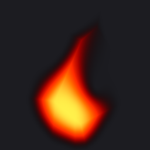
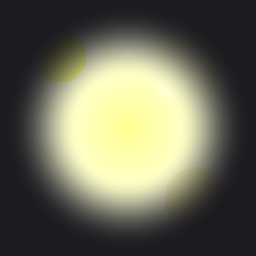
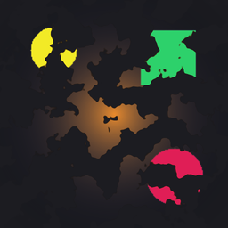
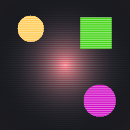
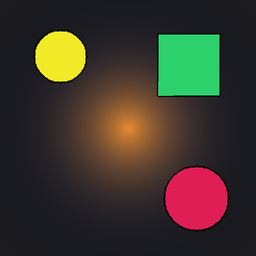
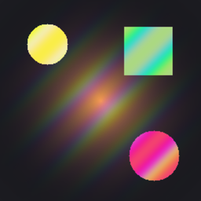
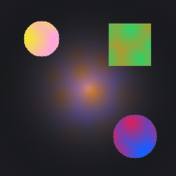
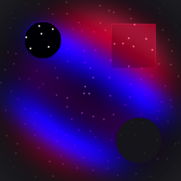
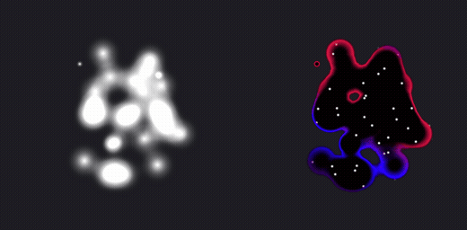

<p align="center">
  
</p>
<p align="center">
  
  
  
</p>

Godot editor plugin for 2D shaders on sprites, UI and any other `CanvasItem`, built without a node graph or shader code. Stack layers in a list, tune sliders against a live preview, export a plain `.gdshader`.

<table>
<tr>
<td align="center"><br><code>flame</code></td>
<td align="center"><br><code>glow</code></td>
<td align="center"><br><code>dissolve</code></td>
<td align="center"><br><code>hologram</code></td>
</tr>
<tr>
<td align="center"><br><code>outline</code></td>
<td align="center"><br><code>sprite_holographic</code></td>
<td align="center"><br><code>sprite_oil_slick</code></td>
<td align="center"><br><code>metaball_portal</code></td>
</tr>
</table>

Some of the 13 bundled recipes, rendered by the plugin on its default preview sprite at `TIME = 2.0`. Each one opens as an editable stack.

## What it does
- Starts an effect from an empty stack or from one of 13 bundled recipes. Every layer stays editable.
- Builds an effect as an ordered list of layers. Each layer is one function: a noise, a shape, a gradient, a blend, a filter.
- Connects layers through dropdowns. An input lists only the layers below it that produce the right type, so every stack compiles.
- Updates a live preview on a sprite, a text label or a full rect while you drag sliders.
- Randomize rerolls every layer's sliders within their ranges, for exploring variations of a recipe.
- Exports one `.gdshader`. A one-line header comment carries the whole stack, so opening the file restores the layers.
- Routes every edit through the editor's undo history.

## Compared to VisualShader
| | VisualShader | GoShade Turbo |
|---|---|---|
| Layout | node graph, free placement | ordered list of layers |
| Connecting | drag wires between ports | pick an input from a dropdown |
| Starting point | empty graph | 13 recipes |
| Building blocks | engine nodes | 61 functions, one slider per parameter |
| Output | `VisualShader` resource | plain `.gdshader` text file |
| Shader types | `canvas_item`, `spatial`, `particles`, `sky`, `fog` | `canvas_item` only |

## Requirements
- Godot `>= 4.4`. Tested on `4.4`, `4.6`, `4.7`.

## Install
1. Download `goshade_turbo-<version>.zip` from https://github.com/kidsmeal/goshade-turbo/releases.
2. Unzip it into the project root. The zip root is `addons/goshade_turbo/`.
3. Project Settings > Plugins > GoShade Turbo > Enable.

From a clone:
```bash
cp -r addons/goshade_turbo <project>/addons/
```

## Usage


Every layer outputs one of two types:
- `field`: one number per pixel, usually `0` to `1`. Noise, gradients and shapes are fields. Fields drive masks, blends and transparency.
- `color`: an RGBA color per pixel. Fills, color ramps, blends and the sprite's own texture are colors.

Layers that draw a pattern (noise, gradients, shapes) have a Position and movement group: scale, position, rotation, movement speed, and two distortion inputs that take another field.

Start from a recipe:
1. Open the GoShade Turbo tab next to 2D, 3D and Script.
2. Recipes > pick one, e.g. `sprite_holographic`.
3. Select a layer in Layers and drag its sliders in Layer settings. Press Randomize to reroll every slider.
4. Export. Assign the `.gdshader` to a `ShaderMaterial` on any `CanvasItem`.

Build from empty:
1. Pick Create Empty Stack.
2. Add `generative/fbm` (fractal noise). Set its scale to `4`.
3. Add `color/gradient_map`. In Inputs, set its field to the fbm layer. Pick two colors.
4. In Final output, set Output color to the gradient_map layer and Transparency to Opaque.
5. Export.

An exported shader works on any `CanvasItem`, including a `Sprite2D` that displays a `SubViewport`. Below, a `GPUParticles2D` vortex renders soft white particles into a `SubViewport` (left). A stack adapted from the `metaball_portal` recipe (last tile in the gallery above) merges them into one shape with a colored rim (right). Scene and stack: `sandbox/vortex/`.



Panel, picker, coordinate spaces, export header: `docs/USAGE.md`. Writing a new library entry, step by step: `docs/TUTORIAL_CELL_BORDERS.md`.

## Library
61 functions in six folders:
- `generative`: noise, gradients, stripes, checker, voronoi and cell patterns, clock.
- `sdf`: shapes as distance fields (circle, box, star, polygon, ring, line) and ways to combine them.
- `fieldops`: math on fields (remap, smoothstep, invert, ease, min, max, mix).
- `color`: fill, gradient map, palette, blend modes, hue, saturation, posterize.
- `source`: the node's own texture, or the screen behind it.
- `filter`: blur, pixelate, dither, outline, chromatic split of a source.

Kind signatures and math sources for each: `docs/LIBRARY.md`.

## Tests
Commands, setup, and GPU requirements: `docs/TESTING.md`.

## Attribution
- Logo: Zen Dots, SIL Open Font License 1.1, `sandbox/logo/fonts/`. Rendered through the plugin's export, `sandbox/logo/`.
- `generative/hash`: David Hoskins hash12, MIT. Every other function cites its source in `docs/LIBRARY.md`.
- AI use: the code, tests and docs were written by AI coding agents, Anthropic Claude and OpenAI Codex. Exceptions, written by hand: `fieldops/ease`, `fieldops/ratchet`, `generative/cell_borders_round_varied`, `generative/cell_borders_edge_warp`.

## License
MIT. See `LICENSE`. Design and build history: `docs/dev/`.
